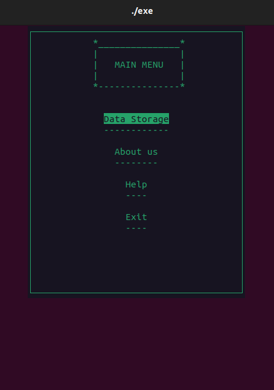
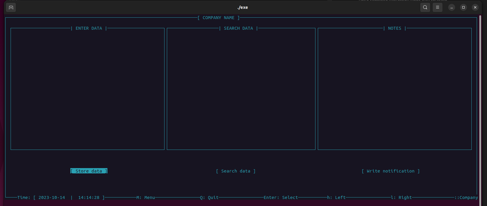

# Datastorage

This program uses ncurses to create a Text User Interface (TUI) inside the terminal where users can store data.

<div style="display: flex; flex-direction: row;">
  <div style="text-align: center;">
    
    <p>Menu</p>
  </div>
  <div style="text-align: center;">
    
    <p>Data Storage</p>
  </div>
</div>


## Store Data

- The `StoreData` feature uses a structure for data storage.
- When you enter data, it will store the entered user in a dynamically allocated binary tree.
- The binary tree is sorted with the following rules: nodes on the left go bigger, nodes on the right go smaller.

## Search User

- The `SearchUser` feature uses a binary tree traversal to search for a specific user.
- The traversal technique can be easily changed to infix, prefix, or postfix.
- It uses `strcmp` and `agecmp` to find the correct node.

## Notes

- This program stores notes statically inside the window.

After the program has finished its operation, it will free the binary tree. This program was created for learning purposes to explore the power and techniques of dynamic programming. It's just one of many techniques you can learn from.

Feel free to check out the program and try creating something similar yourself. It's a great way to learn!

## Required Libraries

To run this program, you need to install the `ncurses` library:
```bash
sudo apt-get install libncurses5-dev libncursesw5-dev 


